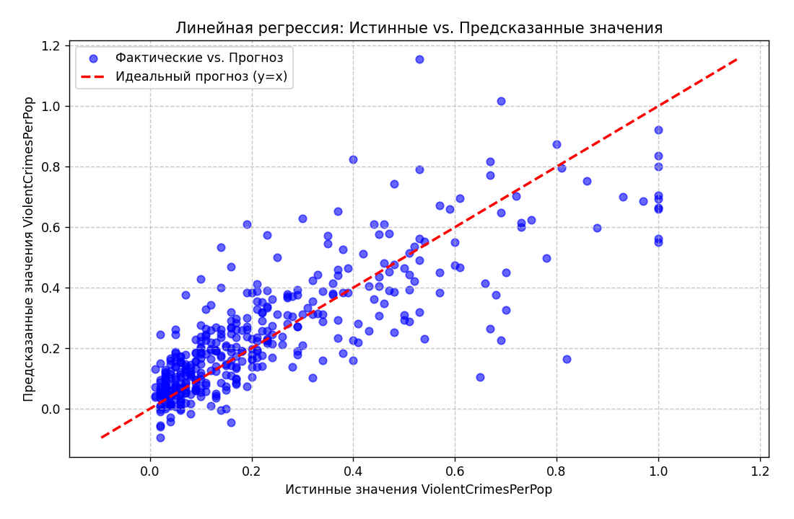
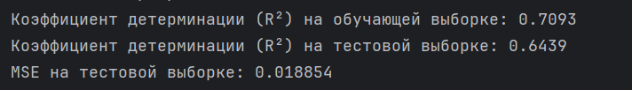
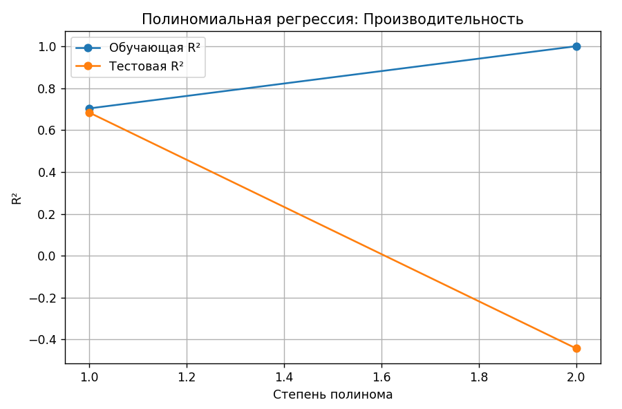
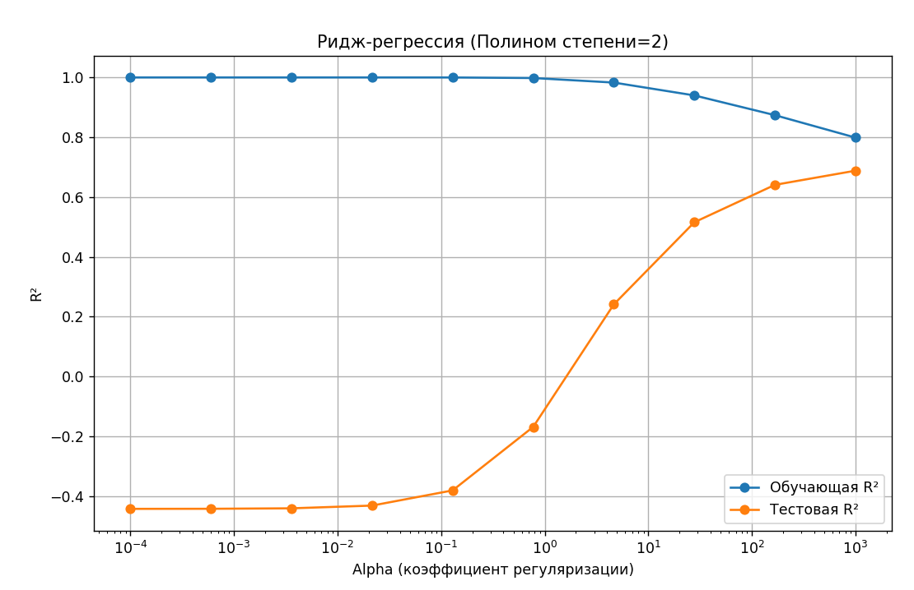

# Лабораторная работа 3. Линейная регрессия
## Задание
Перед выполнением лабораторной работы необходимо загрузить набор данных в соответствии с вариантом на диск

1. Написать программу, которая разделяет исходную выборку на обучающую и тестовую (training set, test set). Использовать стандартные функции (train_test_split и др. нельзя).
2. С использованием библиотеки scikit-learn обучить модель линейной регрессии по обучающей выборке пример
3. Проверить точность модели по тестовой выборке
4. Построить модель с использованием полиномиальной функции. Построить графики зависимости точности на обучающей и тестовой выборке от степени полиномиальной функции.
5. Построить модель с использованием регуляризации. На основе экспериментов подобрать параметры для регуляризации. Построить графики зависимости точности модели на обучающей и тестовой выборках от коэффициента регуляризации.

Communities and Crime

## Загрузка dataset
```
def load_communities_data():
    # Загрузка данных из файла communities.data
    data = pd.read_csv('communities.data', header=None, names=column_names, na_values='?')
    
    # Целевая переменная - ViolentCrimesPerPop
    X = data.drop('ViolentCrimesPerPop', axis=1)
    y = data['ViolentCrimesPerPop']
    
    return X, y
```
x - Features, Признаки. y - Targets, Цели

Осуществляется подгрузка с сервера. В данном варианте я рассматривал 2 степени полиномов.
```
degrees = range(1, 3) # Это создает диапазон [1, 2]
```
Степень 1 - это обычная линейная регрессия (без полиномиальных признаков)
Степень 2 - полиномиальная регрессия с квадратичными членами и взаимодействиями

Степени 1-2 проще интерпретировать физически, а 3-4 способствует переобучению модели

## 1. Разделение исходной выборки на обучающую и тестовую в соотношении (20/80)
В примере из документации sklearn под тестовую выборку выделяется 20% данных. Поступим так же: с помощью стандартной функции sample() из библиотеки pandas, которая возвращает случайную подвыборку строк, отбираем 80% строк датафрейма. Тогда в тестовую выборку test_df с помощью функции drop() заносим оставшиеся 20% строк исходного датафрейма.

80% - достаточно данных для качественного обучения. 20% - достаточно данных для надежной оценки.
```
# Общее количество наблюдений
n_samples = X.shape[0]

# Массив индексов от 0 до n_samples-1
indices = np.arange(n_samples)

# Перемешиваем индексы случайным образом для того чтобы избежать упорядочности данных
np.random.shuffle(indices)

# Применяем перемешанные индексы к X и y (DataFrame/Series)
X_shuffled = X.iloc[indices]
y_shuffled = y.iloc[indices]

# Разделяем перемешанные данные (80 - обучение 20 - тестирование)
train_size = int(n_samples * 0.8)

X_train = X_shuffled[:train_size]  # обучающая выборка
X_test = X_shuffled[train_size:]   # тестовая выборка

y_train = y_shuffled[:train_size]
y_test = y_shuffled[train_size:]

```
## 2. Модель линейной регрессии
Линейная регрессия - статистический метод моделирования зависимости между независимыми переменными (признаками) и зависимой переменной (целевой величиной).

С использованием библиотеки scikit-learn обучить модель линейной регрессии по обучающей выборке

Создаём объект regressor класса LinearRegression и применяем метод fit() для обучения модели:


```
from sklearn.linear_model import LinearRegression

regressor = LinearRegression().fit(X_train, y_train)

y_train_pred = regressor.predict(X_train)
y_test_pred = regressor.predict(X_test)
```



Математическая формула линейной регрессии:
h(x) = w₀ + w₁x₁ + w₂x₂ + ... + wₙxₙ

## 3. Проверить точность модели по тестовой выборке
Проверка точности - это процесс оценки способности модели делать правильные предсказания на новых, ранее не виденных данных.

Для оценки качества модели используются метрики. Они помогают понять, насколько хорошо модель справляется с задачей предсказания. Мы можем использовать две основные метрики: MSE и R².

MSE (среднеквадратичная ошибка) измеряет абсолютное среднее отклонение предсказаний от реальных значений. Она удобна для сравнения моделей, работающих с одними единицами измерения, но ее значение сильно зависит от масштаба данных и чувствительно к выбросам.

R² (коэффициент детерминации) – это нормированная метрика, показывающая, какую долю изменчивости целевой переменной модель смогла объяснить. R² всегда находится в диапазоне от минус бесконечности до 1, где 1 означает идеальное предсказание. Благодаря своей нормированности, R² позволяет сравнивать модели независимо от масштаба данных, что делает его универсальным инструментом оценки.

Остановимся на использовании метрики R2. Для оценки модели по выбранной метрике будем использовать стандартную функцию r2_score. 

```
from sklearn.metrics import mean_squared_error, r2_score

print(f"Коэффициент детерминации (R²) на обучающей выборке: {r2_score(y_train, y_train_pred):.4f}")
print(f"Коэффициент детерминации (R²) на тестовой выборке: {r2_score(y_test, y_test_pred):.4f}")
print(f"MSE на тестовой выборке: {mean_squared_error(y_test, y_test_pred):.6f}")
```

<p align="center">
  
</p>

## 4.Построить модель с использованием полиномиальной функции
Полиномиальная регрессия — это метод машинного обучения, используемый для моделирования нелинейных зависимостей между переменными путем аппроксимации данных полиномом степени (k). В отличие от линейной регрессии, которая предполагает прямую связь, этот метод позволяет учитывать более сложные криволинейные тренды в данных, что делает его полезным в различных областях, таких как экономика и инженерия.
Используется Pipeline для автоматизации процесса трансформации признаков:
```
from sklearn.pipeline import Pipeline
from sklearn.preprocessing import PolynomialFeatures

degrees = range(1, 3)
r2_train_list = []
r2_test_list = []

for degree in degrees:
    pipeline = Pipeline([
        ("poly_features", PolynomialFeatures(degree=degree, include_bias=False)),
        ("scaler", StandardScaler()),
        ("linear_regression", LinearRegression())
    ])
    
    pipeline.fit(X_train, y_train)
    y_train_pred = pipeline.predict(X_train)
    y_test_pred = pipeline.predict(X_test)
    
    r2_train_list.append(r2_score(y_train, y_train_pred))
    r2_test_list.append(r2_score(y_test, y_test_pred))
```


## 5. Построить модель с использованием регуляризации
Ridge-регрессия (или гребневая регрессия) — это регуляризованная версия линейной регрессии, которая используется для борьбы с мультиколлинеарностью (линейной зависимостью между предикторами) и переобучением. Она добавляет к функции потерь штрафное слагаемое в виде квадрата коэффициентов, чтобы сделать веса модели меньше, но не обнулить их, в отличие от Lasso-регрессии.

Почему используется Ridge-регрессия:

Полиномиальные признаки сильно коррелированы между собой

Ridge лучше справляется с мультиколлинеарностью

Сохраняет все признаки (в отличие от Lasso)
```
degree = 2
alphas = np.logspace(-4, 3, 10)  # диапазон коэффициентов регуляризации

r2_train_ridge = []
r2_test_ridge = []

for alpha in alphas:
    pipeline = Pipeline([
        ("poly", PolynomialFeatures(degree=degree, include_bias=False)),
        ("scaler", StandardScaler()),
        ("ridge", Ridge(alpha=alpha, max_iter=10000))
    ])
    
    pipeline.fit(X_train, y_train)
    y_train_pred = pipeline.predict(X_train)
    y_test_pred = pipeline.predict(X_test)
    
    r2_train_ridge.append(r2_score(y_train, y_train_pred))
    r2_test_ridge.append(r2_score(y_test, y_test_pred))
```
Компоненты Pipeline:

PolynomialFeatures(degree=2) – создаёт полиномиальные признаки 2-й степени

StandardScaler() – нормализует признаки (важно для регуляризации)

Ridge(alpha=α) – линейная регрессия с L2-регуляризацией


